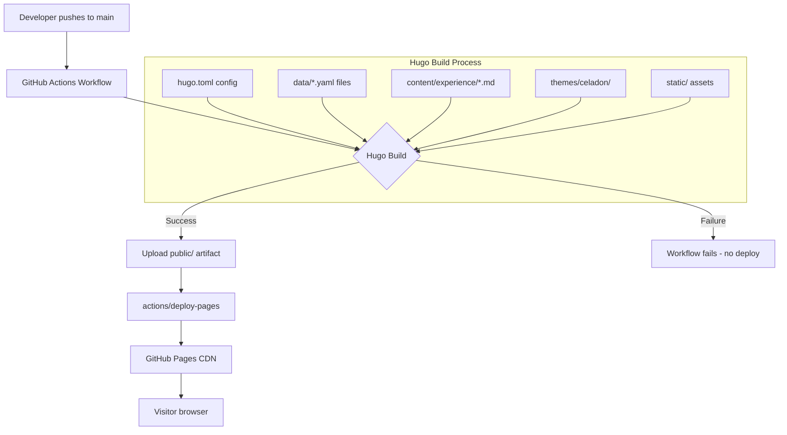
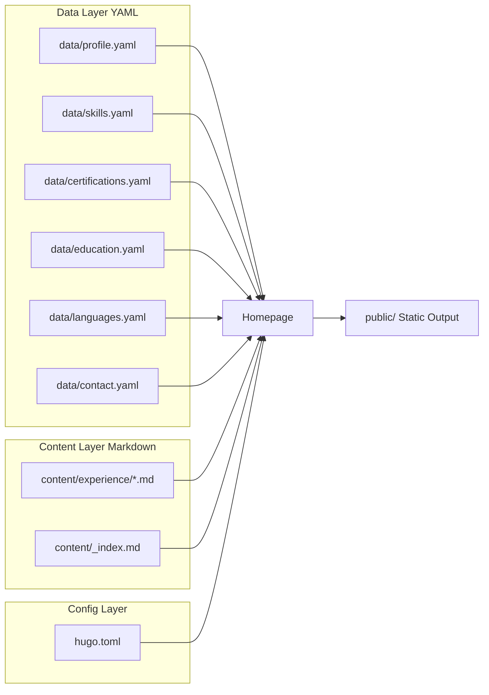

# Design Document

## Professional Portfolio Site — Miguel Romero

---

## Overview

This document describes the technical design for building and deploying a professional portfolio website for Miguel Romero, Senior Solutions Architect at AWS. The site is a static, one-page portfolio built with [Hugo](https://gohugo.io/) using the [hugo-celadon](https://github.com/Yajie-Xu/hugo-celadon) theme, hosted on GitHub Pages and deployed automatically via GitHub Actions.

### Key Design Decisions

**Hugo + hugo-celadon**: The celadon theme is a data-driven, one-page portfolio theme. Its architecture separates homepage layout (driven by YAML data files in `data/`) from deep content pages (Markdown files in `content/`). Most portfolio content (profile, skills, certifications, education, languages, contact) lives in YAML data files, while experience entries live as individual Markdown files in `content/experience/`.

**Single-page architecture with smooth scrolling**: The celadon theme renders all sections on a single homepage with anchor-based navigation. Each section corresponds to a named anchor (`#about`, `#experience`, etc.) and the navigation menu links to these anchors.

**Data-driven sections**: The homepage sections are configured in `hugo.toml` under `[params.homepage]`. Each section name maps to a YAML file in `data/`. This makes content updates straightforward without touching templates.

**GitHub Actions deployment**: The official Hugo-recommended workflow deploys directly to GitHub Pages using the `actions/deploy-pages` action, triggered on every push to `main`.

---

## Architecture



### Content Flow



---

## Components and Interfaces

### 1. Hugo Configuration (`hugo.toml`)

The central configuration file controls site metadata, theme selection, navigation menu, and section ordering.

```toml
baseURL = "https://migu3lr.github.io/"
languageCode = "en-us"
title = "Miguel Romero - Solutions Architect"
theme = "celadon"

[params]
  description = "Senior Solutions Architect at AWS specializing in cloud transformation, generative AI, and data engineering."

[params.homepage]
  sections = ["hero", "experience", "skills", "certifications", "education", "languages", "contact"]

[params.homepage.experience]
  enable = true
  title = "Experience"
  layout = "cards"

[params.homepage.skills]
  enable = true
  title = "Skills"
  layout = "grid"

[params.homepage.certifications]
  enable = true
  title = "Certifications"
  layout = "cards"

[params.homepage.education]
  enable = true
  title = "Education"
  layout = "cards"

[params.homepage.languages]
  enable = true
  title = "Languages"
  layout = "grid"

[params.homepage.contact]
  enable = true
  title = "Contact"
  layout = "cards"

[menu]
  [[menu.main]]
    name = "About"
    url = "#hero"
    weight = 1
  [[menu.main]]
    name = "Experience"
    url = "#experience"
    weight = 2
  [[menu.main]]
    name = "Skills"
    url = "#skills"
    weight = 3
  [[menu.main]]
    name = "Certifications"
    url = "#certifications"
    weight = 4
  [[menu.main]]
    name = "Education"
    url = "#education"
    weight = 5
  [[menu.main]]
    name = "Contact"
    url = "#contact"
    weight = 6
```

### 2. Profile Data (`data/profile.yaml`)

Drives the hero/about section on the homepage.

```yaml
name: "Miguel Romero"
title: "Senior Solutions Architect"
affiliation: "Amazon Web Services"
location: "Bogota, Colombia"
summary: >
  Senior Solutions Architect specializing in cloud transformation, AWS architecture,
  generative AI, and data engineering. Helping organizations accelerate their journey
  to the cloud with pragmatic, well-architected solutions.
email: "miguel.romerog@outlook.com"
linkedin: "https://www.linkedin.com/in/miguelromerog/"
avatar: "/images/profile.jpg"
```

### 3. Experience Content (`content/experience/`)

Each position is an independent Markdown file with front matter. The celadon theme renders these as cards.

```
content/
└── experience/
    ├── _index.md
    ├── aws-solutions-architect.md
    ├── 4strategies-big-data-engineer.md
    ├── cencosud-aws-architect.md
    └── hardtech-it-consultant.md
```

Front matter schema for each experience file:

```yaml
---
title: "Solutions Architect"
company: "Amazon Web Services"
startDate: "2022-08"
endDate: ""          # empty string = current position, renders as "Present"
location: "Bogota, Colombia"
weight: 1            # lower weight = rendered first (most recent)
---
```

The Markdown body contains the list of responsibilities and achievements.

### 4. Skills Data (`data/skills.yaml`)

```yaml
categories:
  - name: "Cloud Architecture"
    skills:
      - "AWS Cloud Architecture"
      - "Migration & Modernization"
      - "SaaS Solutions"
  - name: "Artificial Intelligence"
    skills:
      - "Generative AI"
      - "AI Practitioner"
  - name: "Data"
    skills:
      - "Data Engineering"
      - "Data Lakes"
      - "Data Warehousing"
  - name: "Strategy"
    skills:
      - "Enterprise Architecture"
      - "Digital Transformation"
```

### 5. Certifications Data (`data/certifications.yaml`)

```yaml
items:
  - name: "AWS Certified AI Practitioner"
    year: 2025
    issuer: "Amazon Web Services"
  - name: "AWS Generative AI Technical Intermediate"
    year: 2025
    issuer: "Amazon Web Services"
  - name: "AWS Industry Financial Services Foundational"
    year: 2025
    issuer: "Amazon Web Services"
  - name: "AWS Industry Healthcare Intermediate"
    year: 2025
    issuer: "Amazon Web Services"
  - name: "AWS Certified Security - Specialty"
    year: 2023
    issuer: "Amazon Web Services"
  - name: "AWS Certified Developer - Associate"
    year: 2023
    issuer: "Amazon Web Services"
  - name: "AWS Certified Solutions Architect - Associate"
    year: 2022
    issuer: "Amazon Web Services"
```

### 6. Education Data (`data/education.yaml`)

```yaml
items:
  - degree: "Master's Degree in Strategic Management in IT"
    institution: "Universidad Internacional Iberoamericana"
    year: 2020
  - degree: "Electronic Engineering"
    institution: "Universidad del Magdalena"
    year: 2015
```

### 7. Languages Data (`data/languages.yaml`)

```yaml
items:
  - language: "Spanish"
    level: "Native"
  - language: "English"
    level: "B2"
  - language: "Portuguese"
    level: "Technical-Intermediate"
```

### 8. Contact Data (`data/contact.yaml`)

```yaml
email: "miguel.romerog@outlook.com"
phone: "+57 300 816 2990"
linkedin: "https://www.linkedin.com/in/miguelromerog/"
```

### 9. GitHub Actions Workflow (`.github/workflows/hugo.yaml`)

The deployment pipeline follows the official Hugo GitHub Pages workflow.

```yaml
name: Build and deploy
on:
  push:
    branches:
      - main
  workflow_dispatch:
permissions:
  contents: read
  pages: write
  id-token: write
concurrency:
  group: pages
  cancel-in-progress: false
defaults:
  run:
    shell: bash
jobs:
  build:
    runs-on: ubuntu-latest
    env:
      HUGO_VERSION: 0.147.0
    steps:
      - name: Checkout
        uses: actions/checkout@v4
        with:
          submodules: recursive
          fetch-depth: 0
      - name: Setup Pages
        id: pages
        uses: actions/configure-pages@v5
      - name: Install Hugo
        run: |
          curl -sLJO "https://github.com/gohugoio/hugo/releases/download/v${HUGO_VERSION}/hugo_extended_${HUGO_VERSION}_linux-amd64.tar.gz"
          mkdir "${HOME}/.local/hugo"
          tar -C "${HOME}/.local/hugo" -xf "hugo_extended_${HUGO_VERSION}_linux-amd64.tar.gz"
          rm "hugo_extended_${HUGO_VERSION}_linux-amd64.tar.gz"
          echo "${HOME}/.local/hugo" >> "${GITHUB_PATH}"
      - name: Build the site
        run: |
          hugo build \
            --gc \
            --minify \
            --baseURL "${{ steps.pages.outputs.base_url }}/"
      - name: Upload artifact
        uses: actions/upload-pages-artifact@v3
        with:
          path: ./public
  deploy:
    environment:
      name: github-pages
      url: ${{ steps.deployment.outputs.page_url }}
    runs-on: ubuntu-latest
    needs: build
    steps:
      - name: Deploy to GitHub Pages
        id: deployment
        uses: actions/deploy-pages@v4
```

### 10. Open Graph Metadata (`content/_index.md`)

```yaml
---
title: "Miguel Romero - Solutions Architect"
description: "Senior Solutions Architect at AWS specializing in cloud transformation, generative AI, and data engineering."
images:
  - "/images/og-preview.jpg"
---
```

The celadon theme's base layout includes Open Graph meta tags derived from these front matter fields.

---

## Data Models

### Experience Entry (Markdown front matter)

| Field | Type | Required | Description |
|-------|------|----------|-------------|
| `title` | string | yes | Job title |
| `company` | string | yes | Company name |
| `startDate` | string (YYYY-MM) | yes | Start date |
| `endDate` | string (YYYY-MM) | no | End date; empty string means current position |
| `location` | string | no | Work location |
| `weight` | integer | yes | Sort order (lower = rendered first) |

Body: Markdown list of responsibilities and achievements.

### Profile (`data/profile.yaml`)

| Field | Type | Required | Description |
|-------|------|----------|-------------|
| `name` | string | yes | Full name |
| `title` | string | yes | Professional title |
| `affiliation` | string | no | Current employer |
| `location` | string | yes | City, Country |
| `summary` | string | yes | Professional bio |
| `email` | string | yes | Contact email |
| `linkedin` | string | yes | LinkedIn profile URL |
| `avatar` | string | no | Path to profile photo in `static/` |

### Skill Category (`data/skills.yaml`)

| Field | Type | Required | Description |
|-------|------|----------|-------------|
| `categories[].name` | string | yes | Category label |
| `categories[].skills` | string[] | yes | List of skill names |

### Certification Entry (`data/certifications.yaml`)

| Field | Type | Required | Description |
|-------|------|----------|-------------|
| `items[].name` | string | yes | Full certification name |
| `items[].year` | integer | yes | Year obtained |
| `items[].issuer` | string | no | Issuing organization |

### Education Entry (`data/education.yaml`)

| Field | Type | Required | Description |
|-------|------|----------|-------------|
| `items[].degree` | string | yes | Degree name |
| `items[].institution` | string | yes | Institution name |
| `items[].year` | integer | yes | Graduation year |

### Language Entry (`data/languages.yaml`)

| Field | Type | Required | Description |
|-------|------|----------|-------------|
| `items[].language` | string | yes | Language name |
| `items[].level` | string | yes | Proficiency level |

### Contact (`data/contact.yaml`)

| Field | Type | Required | Description |
|-------|------|----------|-------------|
| `email` | string | yes | Email address |
| `phone` | string | yes | Phone number |
| `linkedin` | string | yes | LinkedIn URL |

---

## Correctness Properties

*A property is a characteristic or behavior that should hold true across all valid executions of a system — essentially, a formal statement about what the system should do. Properties serve as the bridge between human-readable specifications and machine-verifiable correctness guarantees.*

This feature involves a static site generator with a data-driven content pipeline. The core logic under test is the **data transformation pipeline**: YAML/Markdown data files to Hugo rendering to HTML output. Property-based testing applies to the data validation and rendering logic, where input variation (different content entries, different orderings, different field combinations) reveals correctness issues.

### Property 1: Chronological ordering of dated content sections

*For any* set of content entries (experience positions, certifications, or education degrees) that each have a year or date field, when rendered by the site, the entries SHALL appear in reverse-chronological order (most recent first).

**Validates: Requirements 3.1, 5.4, 6.4**

### Property 2: Content entry field completeness

*For any* content entry (experience position, certification, education degree, or language entry) defined in the data files, when rendered by the site, the output SHALL contain all required fields for that entry type — specifically: title/name, organization/institution, time period/year, and for experience entries at least one responsibility item.

**Validates: Requirements 3.2, 5.2, 6.2, 7.3**

### Property 3: Skills completeness and category grouping

*For any* set of skills defined in `data/skills.yaml`, when the Skills section is rendered, every skill SHALL appear in the output AND each skill SHALL appear under its assigned category heading — no skill is omitted and no skill appears under the wrong category.

**Validates: Requirements 4.1, 4.4**

### Property 4: Current position indicator

*For any* experience entry where `endDate` is empty or absent, the rendered output SHALL display "Present" (or "Presente") as the end date rather than a blank or null value.

**Validates: Requirements 3.4**

### Property 5: Contact link rendering

*For any* email address defined in the contact data, the rendered HTML SHALL contain a `mailto:` hyperlink wrapping that address. *For any* external social profile URL (LinkedIn) defined in the contact data, the rendered HTML SHALL contain an anchor tag with `target="_blank"` pointing to that URL.

**Validates: Requirements 8.2, 8.4**

### Property 6: Navigation menu completeness

*For any* set of sections listed in `hugo.toml` under `params.homepage.sections`, every section name SHALL have a corresponding entry in the rendered navigation menu with a valid anchor link.

**Validates: Requirements 9.1, 9.4**

### Property 7: Static build output purity

*For any* Hugo build of this project, the generated `public/` directory SHALL contain only static file types (`.html`, `.css`, `.js`, `.xml`, `.json`, image formats, font formats) and SHALL NOT contain any server-side executable scripts (`.php`, `.py`, `.rb`, `.cgi`).

**Validates: Requirements 11.3**

### Property 8: Open Graph metadata presence

*For any* build of the site, the rendered `public/index.html` SHALL contain `og:title`, `og:description`, and `og:image` meta tags in the `<head>` element.

**Validates: Requirements 11.4**

---

## Error Handling

### Build-time errors

| Scenario | Behavior |
|----------|----------|
| Missing required front matter field in experience Markdown | Hugo build fails with a descriptive error; no partial output is published |
| Malformed YAML in any `data/*.yaml` file | Hugo build fails; GitHub Actions marks the workflow as failed |
| Theme submodule not initialized | Hugo build fails with "theme not found"; the workflow's `submodules: recursive` checkout step prevents this in CI |
| Invalid `baseURL` in `hugo.toml` | Build succeeds but internal links may be broken; validated by smoke test |
| Missing `content/_index.md` | Hugo renders an empty homepage; this file must always be present |

### Deployment errors

| Scenario | Behavior |
|----------|----------|
| Hugo build exits non-zero | GitHub Actions `build` job fails; `deploy` job is skipped (depends on `build`) |
| `actions/deploy-pages` fails | Workflow is marked failed; previous deployment remains live |
| Concurrent pushes to `main` | `concurrency: group: pages, cancel-in-progress: false` ensures the second run waits rather than cancelling the first |

### Content errors

| Scenario | Behavior |
|----------|----------|
| Profile photo not found in `static/` | Hugo renders the About section without an image (graceful degradation) |
| LinkedIn URL malformed | Link renders but navigates to an invalid URL; validated by content review |
| Empty `endDate` field | Renders as "Present" by template logic (Property 4) |

---

## Testing Strategy

This project is a static site with a data-driven content pipeline. The testing approach combines four layers:

1. **Smoke tests** — verify project structure, configuration, and build prerequisites
2. **Example-based unit tests** — verify specific content is present in data files and rendered output
3. **Property-based tests** — verify universal rendering properties across all content entries
4. **Integration tests** — verify the full build pipeline and deployment configuration

### PBT Applicability Assessment

Property-based testing IS applicable to this feature because:
- The rendering logic (data entry to HTML output) is a pure transformation with clear input/output behavior
- Input variation (different entries, different field values, different orderings) reveals correctness issues
- The properties (ordering, completeness, link rendering) hold universally across all valid inputs
- Tests can run against the data files and rendered HTML without external service calls

PBT is NOT applied to:
- GitHub Actions workflow behavior (external service — use integration tests)
- Responsive layout and visual rendering (requires browser — use manual/visual regression tests)
- Keyboard accessibility (requires manual testing)

### Property-Based Testing Library

Use **[fast-check](https://fast-check.dev/)** with **[Vitest](https://vitest.dev/)** as the test runner. Tests are written in TypeScript and operate against the YAML data files and the rendered HTML output from `hugo build`.

Each property test MUST run a minimum of **100 iterations**.

Tag format: `// Feature: professional-portfolio-site, Property N: <property_text>`

### Test Matrix

| Test Type | What is tested | Tool |
|-----------|---------------|------|
| Smoke | Hugo project structure, config values, .gitmodules | Vitest + fs assertions |
| Smoke | Workflow file exists, has correct trigger and submodule step | Vitest + YAML parse |
| Example | data/profile.yaml contains required fields and values | Vitest |
| Example | data/certifications.yaml contains all 7 certifications | Vitest |
| Example | data/education.yaml contains both degrees | Vitest |
| Example | content/experience/ contains 4 position files | Vitest |
| Example | Rendered index.html contains correct `<title>` | Vitest + HTML parse |
| Property 1 | Dated entries render in reverse-chronological order | fast-check + Vitest |
| Property 2 | All required fields appear in rendered entry output | fast-check + Vitest |
| Property 3 | All skills appear grouped by category in rendered output | fast-check + Vitest |
| Property 4 | Empty endDate renders as "Present" | fast-check + Vitest |
| Property 5 | Email renders as mailto:, LinkedIn renders with target=_blank | fast-check + Vitest |
| Property 6 | All configured sections appear in navigation menu | fast-check + Vitest |
| Property 7 | public/ contains only static file types after build | fast-check + Vitest |
| Property 8 | index.html contains og:title, og:description, og:image | Vitest + HTML parse |
| Integration | hugo build exits 0 and generates public/ | Shell + Vitest |
| Integration | Workflow file has correct push trigger on main | Vitest + YAML parse |

### Dual Testing Approach

Unit/example tests catch concrete content bugs (wrong name, missing certification). Property tests verify the rendering logic is correct for any valid input — they catch bugs that only appear with unusual data (e.g., an entry with a very long title, a year of 0, or a skills list with a single item).

Both are complementary. Avoid writing too many example tests for the same rendering logic that a property test already covers.
